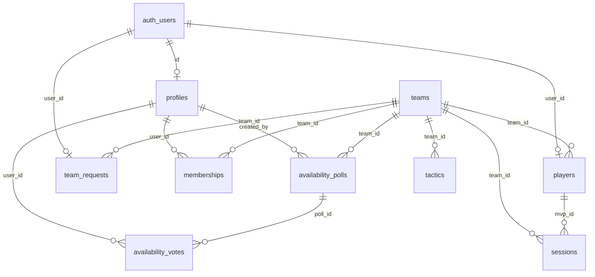

# 🗄️ JB-SQUAD ELITE — Database Schema (Supabase)

> **Última actualización:** 19/04/2026  
> **Proveedor:** Supabase (PostgreSQL)  
> **Nota:** Este esquema es solo de referencia. No ejecutar directamente.

---

## Diagrama de Relaciones



---

## Tablas

### `teams`
Clubes registrados en la plataforma.

```sql
CREATE TABLE public.teams (
  id uuid NOT NULL DEFAULT uuid_generate_v4(),
  name text NOT NULL,
  created_at timestamp with time zone DEFAULT now(),
  owner_id uuid,
  crest_url text,
  CONSTRAINT teams_pkey PRIMARY KEY (id)
);
```

---

### `profiles`
Perfil público del usuario. Se crea al registrarse.

```sql
CREATE TABLE public.profiles (
  id uuid NOT NULL,
  full_name text,
  avatar_id integer DEFAULT 1,
  created_at timestamp with time zone DEFAULT now(),
  CONSTRAINT profiles_pkey PRIMARY KEY (id),
  CONSTRAINT profiles_id_fkey FOREIGN KEY (id) REFERENCES auth.users(id)
);
```

---

### `memberships`
Vinculación usuario ↔ equipo con su rol.

```sql
CREATE TABLE public.memberships (
  id uuid NOT NULL DEFAULT uuid_generate_v4(),
  user_id uuid,
  team_id uuid,
  role text DEFAULT 'jugador'::text CHECK (role = ANY (ARRAY['manager'::text, 'capitan'::text, 'jugador'::text])),
  CONSTRAINT memberships_pkey PRIMARY KEY (id),
  CONSTRAINT memberships_user_id_fkey FOREIGN KEY (user_id) REFERENCES public.profiles(id),
  CONSTRAINT memberships_team_id_fkey FOREIGN KEY (team_id) REFERENCES public.teams(id)
);
```

---

### `players`
Ficha técnica del jugador (posición, stats, foto, dorsal...).

```sql
CREATE TABLE public.players (
  id uuid NOT NULL DEFAULT gen_random_uuid(),
  name text NOT NULL,
  console_id text,
  avatar_id integer DEFAULT 1,
  primary_pos text DEFAULT 'DC'::text,
  secondary_pos ARRAY DEFAULT '{}'::text[],
  dorsal text DEFAULT '0'::text,
  stats jsonb DEFAULT '{"friendly": {"mvps": 0, "goals": 0, "assists": 0, "matches": 0}, "official": {"mvps": 0, "goals": 0, "assists": 0, "matches": 0}}'::jsonb,
  created_at timestamp with time zone DEFAULT now(),
  team_id uuid,
  user_id uuid UNIQUE,
  photo_url text,
  photo_scale double precision DEFAULT 1.0,
  mvp_count integer DEFAULT 0,
  photo_x integer DEFAULT 0,
  photo_y integer DEFAULT 0,
  CONSTRAINT players_pkey PRIMARY KEY (id),
  CONSTRAINT players_team_id_fkey FOREIGN KEY (team_id) REFERENCES public.teams(id),
  CONSTRAINT players_user_id_fkey FOREIGN KEY (user_id) REFERENCES auth.users(id)
);
```

---

### `sessions`
Jornadas de juego (activas o cerradas). El campo `matches` almacena un JSON con todos los partidos.

```sql
CREATE TABLE public.sessions (
  id uuid NOT NULL DEFAULT gen_random_uuid(),
  date text NOT NULL,
  status text DEFAULT 'active'::text,
  mvp_id uuid,
  matches jsonb DEFAULT '[]'::jsonb,
  created_at timestamp with time zone DEFAULT now(),
  team_id uuid,
  type text DEFAULT 'amistoso'::text,
  CONSTRAINT sessions_pkey PRIMARY KEY (id),
  CONSTRAINT sessions_mvp_id_fkey FOREIGN KEY (mvp_id) REFERENCES public.players(id),
  CONSTRAINT sessions_team_id_fkey FOREIGN KEY (team_id) REFERENCES public.teams(id)
);
```

---

### `tactics`
Tácticas guardadas con formación y asignaciones de jugadores.

```sql
CREATE TABLE public.tactics (
  id uuid NOT NULL DEFAULT gen_random_uuid(),
  name text NOT NULL,
  formation text NOT NULL,
  assignments jsonb DEFAULT '{}'::jsonb,
  is_active boolean DEFAULT false,
  created_at timestamp with time zone DEFAULT now(),
  team_id uuid,
  custom_positions jsonb DEFAULT '{}'::jsonb,
  CONSTRAINT tactics_pkey PRIMARY KEY (id),
  CONSTRAINT tactics_team_id_fkey FOREIGN KEY (team_id) REFERENCES public.teams(id)
);
```

---

### `availability_polls`
Convocatorias de disponibilidad (abiertas o cerradas).

```sql
CREATE TABLE public.availability_polls (
  id uuid NOT NULL DEFAULT uuid_generate_v4(),
  team_id uuid NOT NULL,
  created_by uuid NOT NULL,
  title text NOT NULL,
  scheduled_time timestamp with time zone NOT NULL,
  status text NOT NULL DEFAULT 'open'::text,
  created_at timestamp with time zone DEFAULT now(),
  final_alignment jsonb,
  CONSTRAINT availability_polls_pkey PRIMARY KEY (id),
  CONSTRAINT availability_polls_team_id_fkey FOREIGN KEY (team_id) REFERENCES public.teams(id),
  CONSTRAINT availability_polls_created_by_fkey FOREIGN KEY (created_by) REFERENCES public.profiles(id)
);
```

---

### `availability_votes`
Votos individuales de cada jugador en una convocatoria.

```sql
CREATE TABLE public.availability_votes (
  id uuid NOT NULL DEFAULT uuid_generate_v4(),
  poll_id uuid NOT NULL,
  user_id uuid NOT NULL,
  vote text NOT NULL,
  minutes_late integer DEFAULT 0,
  voted_at timestamp with time zone DEFAULT now(),
  CONSTRAINT availability_votes_pkey PRIMARY KEY (id),
  CONSTRAINT availability_votes_poll_id_fkey FOREIGN KEY (poll_id) REFERENCES public.availability_polls(id),
  CONSTRAINT availability_votes_user_id_fkey FOREIGN KEY (user_id) REFERENCES public.profiles(id)
);
```

---

### `invitations`
Códigos de invitación para registro privado.

```sql
CREATE TABLE public.invitations (
  id uuid NOT NULL DEFAULT gen_random_uuid(),
  code text NOT NULL UNIQUE,
  max_uses integer DEFAULT 20,
  used_count integer DEFAULT 0,
  created_at timestamp with time zone DEFAULT now(),
  CONSTRAINT invitations_pkey PRIMARY KEY (id)
);
```

---

### `team_requests`
Solicitudes de fichaje pendientes de aprobación.

```sql
CREATE TABLE public.team_requests (
  id uuid NOT NULL DEFAULT uuid_generate_v4(),
  user_id uuid NOT NULL UNIQUE,
  team_id uuid NOT NULL,
  created_at timestamp with time zone DEFAULT now(),
  CONSTRAINT team_requests_pkey PRIMARY KEY (id),
  CONSTRAINT team_requests_user_id_fkey FOREIGN KEY (user_id) REFERENCES auth.users(id),
  CONSTRAINT team_requests_team_id_fkey FOREIGN KEY (team_id) REFERENCES public.teams(id)
);
```

---

### `team_config` *(Legacy — en desuso)*
Configuración básica del equipo original. Reemplazada por la tabla `teams`.

```sql
CREATE TABLE public.team_config (
  id integer NOT NULL DEFAULT 1,
  name text DEFAULT 'HERCULES'::text,
  manager_name text DEFAULT 'YEIBI'::text,
  CONSTRAINT team_config_pkey PRIMARY KEY (id)
);
```
